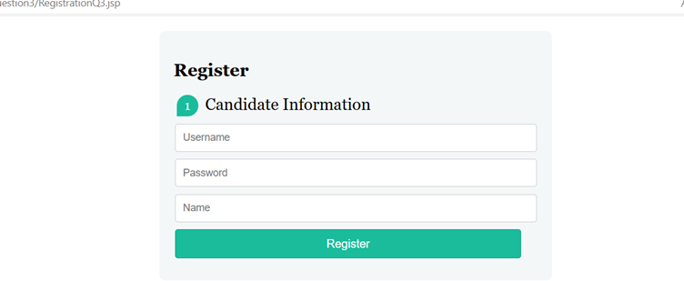
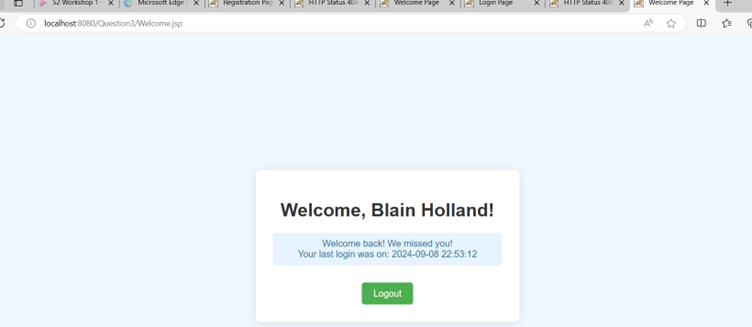
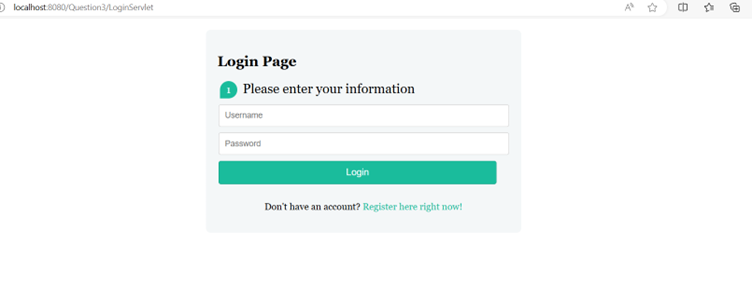

## My Projects (LOOK HERE)
A collection of some HTML, CSS, JavaScript, PHP, C#, Java and other projects I have done over the course of my studies. Please note that not every single file in this repo is included down below.

# User Authentication System with JSP and Servlets

This project implements a simple user authentication system using **Java Servlets** and **JSP** (JavaServer Pages). It includes basic user functionalities such as registration, login, and a personalized welcome page with session management. The system interacts with a **MySQL database** to store and retrieve user credentials.

## Features

- **Login Page**: Users can log in by entering their username and password.
- **Registration Page**: New users can register by providing necessary information.
  
- **Welcome Page**: Displays a personalized greeting along with the user’s last login time.
  
- **Database Interaction**: User information is stored in a MySQL database.
- **Session Management**: Tracks users’ sessions and controls page access.

## Technologies Used

- Java Servlets
- JSP (JavaServer Pages)
- MySQL Database
- HTML & CSS for UI
- JDBC for Database Connectivity

## Project Structure

### JSP Pages:
- `LoginQ3.jsp`: The login page where users enter their credentials.
- `RegistrationQ3.jsp`: The registration page for creating new accounts.
- `Welcome.jsp`: The welcome page shown after successful login.

### Servlets:
- **`LoginServlet.java`**: 
  - Handles user login requests.
  - Validates credentials against the database.
  - Starts a session and redirects the user to the `Welcome.jsp` if the login is successful.
  
- **`RegistrationServlet.java`**: 
  - Handles new user registration.
  - Inserts user details into the database and provides feedback.

## Setup Instructions

### 1. Database Setup
- Create a **MySQL database** named `users`.
- Create a table `user_credentials`:
    ```sql
    CREATE TABLE user_credentials (
        id INT AUTO_INCREMENT PRIMARY KEY,
        username VARCHAR(50) NOT NULL UNIQUE,
        password VARCHAR(50) NOT NULL,
        name VARCHAR(50) NOT NULL,
        first_time_login BOOLEAN DEFAULT TRUE,
        last_login DATETIME
    );
    ```
- Insert sample user data or register users through the registration page.

### 2. Clone the Repository

To clone this repository, use the following command:

```bash
git clone https://github.com/yourusername/authentication-system.git
```

### 3. Configure Database Connection
- In the `LoginServlet.java` and `RegistrationServlet.java`, update the database URL, username, and password with your local MySQL setup:
    ```java
    con = DriverManager.getConnection("jdbc:mysql://localhost:3306/users", "root", "your_password");
    ```

### 4. Deploy the Project
- Use an IDE like **Eclipse** or **IntelliJ IDEA** to deploy this project on a Java web server (e.g., **Apache Tomcat**).
- Access the application at `http://localhost:8080/your-project-name/`.

## How It Works

1. **Login Process**:
   - Users log in with a valid username and password.
   - If the credentials match an entry in the database, a session is created, and the user is redirected to the welcome page.
   - If the credentials are invalid, an error message is shown.

2. **Registration Process**:
   - New users register by filling out the registration form.
   - After a successful registration, they are prompted to log in.

3. **Session Management**:
   - User sessions store the username and personal information to provide a personalized experience.
   - The system tracks if it’s the user’s first time logging in and displays their last login time.
  
Here are screenshots of the main pages:

### Login Page


### Registration Page


### Welcome Page


## Future Enhancements

- **Password Encryption**: Add password hashing to improve security.
- **Logout Feature**: Implement a logout function to end user sessions.
- **Enhanced Validation**: Include email validation and stronger password requirements.

## Author

- **Blain Holland**

## License

This project is licensed under the **MIT License**.

---


# Library Management System


## Overview

A simple Library Management System developed in C#. This system allows members to borrow and return books, librarians to add or remove books, and admins to generate various reports.


## Features


- User Roles: Admin, Librarian, Member

- Borrow and Return Books

- Add and Remove Books

- Generate Reports:

- Borrowed Books

- Overdue Books

- Most Popular Books

- Overdue Notifications


## Technologies Used


- C#

- .NET Framework


## Usage


1.Clone the repository.

2.Open the project in Visual Studio or your preferred C# IDE.

3.Build and run the application.


## License

[
MIT
](
LICENSE
)

# Age Calculator

This project is a simple age calculator form built using HTML, PHP, and CSS. Users can input their birth date, and upon submission, the form calculates and displays their age in years, months, and days.

## HTML & CSS Structure

The `index.html` file contains the structure of the age calculator form:

```html
<!DOCTYPE html>
<html>

<head>
    <style type="text/css">
        #btnSubmit {
            width: 150px;
            background-color: #0179fc;
            color: white;
            margin-top: 20px;
        }
        .container {
            display: flex;
        }
        .dobBoxes {
            margin-right: 20px;
        }
        .monthsBox {
            margin-right: 20px;
        }
        .output {
            background-color: #f7f7f7;
            margin-top: 20px;
        }
    </style>
</head>

<body>

    <h1>Age Calculator</h1>

    <div class="container">
        <div class="dobBoxes">
            <form action="Question2.2.php" method="post" class="form">
                <select style="width:250px" name="day" class="form-day">
                    <option value="" disabled selected hidden>Date</option>
                    <?php
                    for ($i = 1; $i <= 31; $i++) {
                        echo "<option value='$i'>$i</option>";
                    }
                    ?>
                </select>
            </div>

            <div class="monthsBox">
                <select style="width:250px" name="month" class="form-control">
                    <option value="" disabled selected hidden>Month</option>
                    <?php
                    for ($i = 1; $i <= 12; $i++) {
                        echo "<option value='$i'>$i</option>";
                    }
                    ?>
                </select>
            </div>

            <div class="yearsBox">
                <select style="width: 250px" name="year" class="form-control">
                    <option value="" disabled selected hidden>Year</option>
                    <?php $year = date('Y'); ?>
                    <?php
                    for ($i = 1900; $i <= $year; $i++) {
                        echo "<option value='$i'>$i</option>";
                    }
                    ?>
                </select>
            </div>
        </div>

        <input id="btnSubmit" type="submit" name="submit" class="btnSub" value="Click to calculate age">
    </form>

    <div class="output">
        <?php
        if (isset($_POST['submit'])) {
            $day = $_POST['day'];
            $month = $_POST['month'];
            $year = $_POST['year'];

            $dob = $day . '-' . $month . '-' . $year;

            $bday = new DateTime($dob);
            $age = $bday->diff(new DateTime);

            $today = date('Y-m-d');

            echo '<br />';
            echo '<b>Your Birth date: </b>';
            echo $dob;
            echo '<br>';
            echo '<b>Your Age : </b> ';
            echo $age->y;
            echo ' Years, ';
            echo $age->m;
            echo ' Months, ';
            echo $age->d;
            echo ' Days';
        }
        ?>
    </div>
</body>

</html>
```
## How to Use
1. Clone or download the repository.
2. Ensure that the PHP file (Question2.2.php) is in the correct location.
3. Open the index.html file in your web browser to view the age calculator form.
   
## Notes
1. The PHP file processes the form data and calculates the age based on the selected date of birth.
2. Ensure all referenced files (PHP) are correctly linked and available in your project.
   
# Appointment Booking Form

This project is a simple web form for booking appointments. It collects user details, allows them to select a date and time for their appointment, and provides a space for additional messages.

## Features

- Input fields for full name, email, cellphone number, and date selection.
- Date and time pickers for setting the appointment.
- A message box for additional information.
- A button to submit the form.

## HTML Structure

- **`<head>`**: Contains the page title, CSS stylesheet link, and Google Fonts link.
- **`<body>`**: 
  - An image of doctors.
  - A form with fields for user information and appointment details.

    ## CSS Styling

The form and image are styled using the following CSS:

```css
.Appointment1 {
    font-family: 'Raleway', sans-serif;
    margin-left: 50px;
}

.form-details h1 {
    position: relative;
    right: -145px;
}

.form-details hr {
    border: 4px solid;
    border-radius: 5px;
    color: #2dcc70;
    width: 4%;
    position: relative;
    right: 40px;
    top: -8px;
}

.form-details {
    position: relative;
    top: 35px;
}

.Doctor {
    float: left;
    width: 750px;
    height: 670px;
}

.my-forms {
    position: relative;
    left: 50px;
}

.my-forms input[type="text"] {
    width: 40%;
    font-family: 'Raleway', sans-serif;
    padding: 12px 20px;
    margin: 8px 0;
    display: inline-block;
    border: 1px solid #ccc;
    box-sizing: border-box;
    background-color: #f0f0f0;
}

.date-time {
    position: relative;
    left: 165px;
    top: 13px;
    font-family: 'Raleway', sans-serif;
}

#appointment-date {
    position: relative;
    left: 30px;
}

#msgbox {
    width: 40%;
    height: 200px;
    margin: 8px 0;
    padding-left: 25px;
    padding-top: 10px;
    display: inline-block;
    border: 1px solid #ccc;
    box-sizing: border-box;
    background-color: #f0f0f0;
    font-family: 'Raleway', sans-serif;
}

.my-forms button {
    width: 40%;
    background-color: #2dcc70;
    box-sizing: border-box;
    margin: 8px 0;
    border: 1px solid;
    display: inline-block;
    padding: 10px 5px;
    color: white;
    font-family: 'Raleway', sans-serif;
}
```
## How to Use

1. Clone or download the repository.
2. Open the `index.html` file in your web browser.
3. Ensure that the CSS/Appointmentstyle.css file is in the correct location.
4. Fill in the form fields and click "Send" to submit the information.

## Notes

- Ensure that the `CSS/Appointmentstyle.css` file exists and contains the required styles.
- The CSS file styles the form to enhance its appearance and ensure consistent user experience.
- Ensure all referenced files (CSS and images) are correctly linked and available in your project.
- The form currently does not perform any actions upon submission. You may need to implement JavaScript or backend logic to handle form submissions.

## Screenshot


# question1: Car Collection

This project is a simple HTML and JavaScript application that displays a collection of cars in a table format. The table is dynamically generated using JavaScript, which manipulates an array of car names.

## Features

- Displays a list of cars in a table.
- Uses JavaScript to dynamically generate table rows based on an array.
- Demonstrates basic HTML, CSS, and JavaScript integration.

## Code Overview

The HTML structure includes:
- A `<head>` section with a title and CSS styles for the table.
- A `<body>` section containing the table element.

The JavaScript code:
- Initializes an array of car names.
- Modifies the array by removing the last element and adding a new element at the beginning.
- Uses a `for` loop to generate table rows dynamically.

## How to Use

1. Clone or download the repository.
2. Open the `index.html` file in your web browser.
3. The table will display the list of cars in the garage.

## Example


## Code

```html
<!DOCTYPE html>
<html>

<head>
    <title>Car Collection</title>
    <style>
        table,
        td {
            text-align: center;
            border-spacing: 0;
            border-collapse: collapse;
        }
    </style>
</head>

<body>
    <table id="carTable" border="1px solid black">
        <tr>
            <th colspan="2">Cars in my Garage</th>
        </tr>

        <script language="javascript" type="text/javascript">
            var table = document.getElementById("carTable");
            var myArray = new Array();

            myArray[0] = "BMW M4";
            myArray[1] = "Nissan Versa";
            myArray[2] = "Honda Civic";
            myArray[3] = "Hyundai Elantra Hybrid";
            myArray[4] = "Nissan Magnite";
            myArray[5] = "Hyundai Alcazar";

            myArray.pop();
            myArray.unshift("Mercedes Benz S-Class");

            for (var i = 0; i < myArray.length; i++) {
                document.write("<tr><td>MyArray[" + i + "]</td>");
                document.write("<td>" + myArray[i] + "</td></tr>");
            }
        </script>
    </table>
</body>

</html>
```
# question2 :Last Updated Date

This project is a simple HTML and JavaScript application that allows users to input and submit a date. The date is then used to display an alert indicating when the page was last updated.

## Features

- Provides a form for users to input a date.
- Displays an alert with the entered date when the form is submitted.
- Includes basic validation to ensure the date input field is not empty.

## Code Overview

The HTML structure includes:
- A `<head>` section with a title.
- A `<body>` section containing a form with a text input field for the date and a submit button.

The JavaScript code:
- Selects the date input field and form.
- Adds an event listener to the form to handle the `submit` event.
- Defines a function `dateUpdate` that displays an alert with the entered date or prompts the user to enter a date if the field is empty.

## How to Use

1. Clone or download the repository.
2. Open the `index.html` file in your web browser.
3. Enter a date in the format `YYYY-MM-DD` in the input field.
4. Click the "Send Update Details" button.
5. An alert will display with the entered date.

## Code

```html
<!DOCTYPE html>
<html>
<head>
    <title>Last Updated</title>
</head>
<body>
    <fieldset>
        <legend>Update Date</legend>
        <form onsubmit="dateUpdate()" id="myForm">
            <div class="updateDate">
                <label> When was this website updated? :</label>
                <input type="text" id="dateInput" placeholder="YYYY-MM-DD" >
            </div>
            <button type="submit" onclick="dateUpdate()" id="btnUpdate" name="updateDetails">Send Update Details</button>
        </form>
    </fieldset>

    <script>
        const dateInput = document.querySelector("#dateInput");
        const myForm = document.querySelector("#myForm");

        myForm.addEventListener("submit", dateUpdate);

        function dateUpdate(e) {
            e.preventDefault();
            if (dateInput.value === "") {
                alert("Please enter the date");
            } else {
                var valueReturned = document.getElementById("dateInput").value;
                alert("This page was last updated on: " + valueReturned);
            }
        }
    </script>
</body>
</html>
```
# question3: Sign Up Form

This project is a signup form implemented in HTML and JavaScript. The form collects user details and performs validation to ensure the entered data is accurate. It includes fields for names, address, gender, email, mobile number, and location. The CSS can be found at the top of the repo files!

## Features

- Form fields for user input: first name, last name, address, gender, email, mobile number, and location.
- Validation of input fields using regular expressions to ensure correct format.
- Alerts for missing or invalid input.

## Code Overview

### HTML Structure

- **`<head>`**: Includes a Google Font and an external CSS file for styling.
- **`<header>`**: Contains the form title and a logo image.
- **`<body>`**: Includes a form with input fields and buttons for user interaction.

### JavaScript

- **Event Listener**: Added to the form to handle the `submit` event.
- **Validation**: Checks for empty fields and validates input formats using regular expressions.
- **Cookies**: A function is defined to set cookies, but it is incomplete and not functional in the current state.

## How to Use

1. Clone or download the repository.
2. Open the `index.html` file in your web browser.
3. Fill in the form fields and click "Sign-up" to submit.
4. The form will alert you if there are validation issues or missing information.
   
## Example


## Code

```html
<!DOCTYPE html>
<html>

<head>
    <link href="https://fonts.googleapis.com/css2?family=Raleway:ital,wght@0,600;1,600&display=swap" rel="stylesheet">
    <link rel="stylesheet" type="text/css" href="CSS/q3.css">
    <header id="topPage">
        <h1>Sign Up Form</h1>
        
    </header>
    <br>
</head>

<body>
    <form id="formId">
        <div class="form-control" id="names"></div>
        <label>First Name:&nbsp;</label>
        <input id="firstName" type="text" name="firstName" placeholder="First Name">
        <br><br>

        <label>Last Name:&nbsp;</label>
        <input id="lastName" type="text" name="lastName" placeholder="Last Name">
        <br><br>
        </div>

        <div id="addressLabel">
            <label>Address:&nbsp;</label>
            <input id="address" type="text" name="addy" placeholder="Address">
            <br><br>
        </div>

        <div id="genders">
            <label>Gender:&nbsp;</label>
            <input id="male" type="radio" name="GenderM" value="male">
            <label for="male">Male</label>

            <input id="female" type="radio" name="GenderF" value="female">
            <label for="female">Female</label>
            <br><br>
        </div>

        <div id="emailAddy">
            <label>Email Id:&nbsp;</label>
            <input id="email" type="text" name="emailAddress" placeholder="example@gmail.com">
            <br><br>
        </div>
        <div id="mobileNumber">
            <label>Mobile:&nbsp;</label>
            <input id="phoneNumber" type="text" name="phone" placeholder="e.g 083 123 1234">
            <br><br>
        </div>

        <div id="locationDiv">
            <label>Location:&nbsp;</label>
            <select class="required" id="selectLocation" name="selectLocation">
                <option value="" disabled selected>Please Select a Location</option>
                <option value="boardwalk">Boardwalk</option>
                <option value="brooklyn">Brooklyn</option>
                <option value="lynnwood">Lynnwood</option>
                <option value="sunnyside">Sunnyside</option>
                <option value="other">Other</option>
            </select>
        </div>
        <br><br>
        <div id="buttons">
            <button type="submit" onclick="" id="btnSign" name="signUp">Sign-up</button>&nbsp;&nbsp;
            <button type="reset" onclick="" id="btnReset" name="re">Reset</button>
        </div>
    </form>

    <script>
        const myForm = document.getElementById("formId");
        const first_Name = document.getElementById("firstName");
        const last_Name = document.getElementById("lastName");
        const theAddress = document.getElementById("address");
        const emailId = document.getElementById("email");
        const mobile = document.getElementById("phoneNumber");
        const radios = document.getElementById("male");
        const radiosTwo = document.getElementById("female");
        const loc = document.getElementById("selectLocation");

        myForm.addEventListener("submit", (e) => {
            e.preventDefault();
            checkInputs();
        });

        function checkInputs() {
            const first_NameValue = first_Name.value.trim();
            const last_NameValue = last_Name.value.trim();
            const theAddressValue = theAddress.value;
            const emailIdValue = emailId.value.trim();
            const mobileValue = mobile.value.trim();

            if (first_NameValue === "") {
                alert("First Name cannot be blank.");
            } else if (!isFirstName(first_NameValue)) {
                alert("Please enter a valid First Name.");
            }

            if (last_NameValue === "") {
                alert("Last Name cannot be blank.");
            } else if (!isLastName(last_NameValue)) {
                alert("Please enter a valid Last Name.");
            }

            if (theAddressValue === "") {
                alert("Your Address cannot be blank.");
            } else if (!isAddress(theAddressValue)) {
                alert("Please enter a valid address.");
            }


            if (!document.getElementById("male").checked && !document.getElementById("female").checked) {
                alert("Please Select a Gender.");
            }

            if (emailIdValue === "") {
                alert("Email cannot be blank.");
            } else if (!isEmail(emailIdValue)) {
                alert("Please enter a valid Email Address.");
            }

            if (mobileValue === "") {
                alert("Phone number cannot be blank.");
            } else if (!isMobile(mobileValue)) {
                alert("Please enter a valid phone number.");
            }

            if (document.getElementById("selectLocation").value === "") {
                alert("Please select your location.");
            }
        }

        function isFirstName(first_Name) {
            return /^[a-z , .'-]+$/i.test(first_Name);
        }

        function isLastName(last_Name) {
            return /^[a-z , .'-]+$/i.test(last_Name);
        }

        function isAddress(theAddress) {
            return /\d{1,5}\s\w.\s(\b\w*\b\s){1,2}\w*\./i.test(theAddress);
        }

        function isEmail(emailId) {
            return /^[a-zA-Z0-9._-]+@[a-zA-Z0-9.-]+\.[a-zA-Z]{2,6}$/i.test(emailId);
        }

        function isMobile(mobile) {
            return /[0](\d{9})|([0](\d{2})( |-)((\d{3}))( |-)(\d{4}))|[0](\d{2})( |-)(\d{7})/i.test(mobile);
        }

        function cookieFunction(RegCookie, value, daysLeft) {
            const date = new Date();
            date.setTime(date.getTime() + (daysLeft * 86400000)); // 1 day = 24 hours * 60 minutes * 60 seconds * 1000 milliseconds
            let expires = "expires=" + date.toUTCString();
            document.cookie = `${RegCookie}=${value}; ${expires}; path=/`;
        }

        document.getElementById("formId").addEventListener("submit", () => {
            cookieFunction("firstName", first_Name.value, 7);
            cookieFunction("lastName", last_Name.value, 7);
            cookieFunction("address", theAddress.value, 7);
            cookieFunction("email", emailId.value, 7);
            cookieFunction("mobile", mobile.value, 7);
            cookieFunction("gender", radios.checked ? "male" : "female", 7);
            cookieFunction("location", loc.value, 7);
            alert("Form submitted successfully!");
        });
    </script>
</body>
</html>

